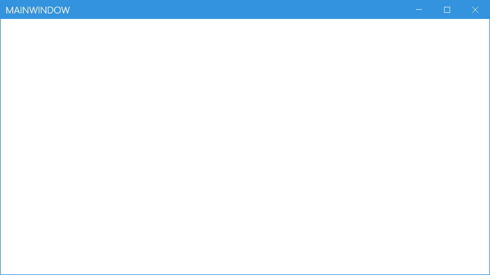

Order: 10
Title: Usage
Description: How to work with the Themes of MahApps.Metro
---

This guide will introduce you to the themes that `MahApps.Metro` has and how to create your own.

All of `MahApps.Metro`'s themes are contained within separate resource dictionaries.

## How to use the themes

You can choose between these available color schemes:

> "Red", "Green", "Blue", "Purple", "Orange", "Lime", "Emerald", "Teal", "Cyan", "Cobalt", "Indigo", "Violet", "Pink", "Magenta", "Crimson", "Amber", "Yellow", "Brown", "Olive", "Steel", "Mauve", "Taupe", "Sienna"

and these base themes:

> "Light", "Dark"

So putting all together, the resource names should be:

> "Light.Blue" or "Dark.Blue"

:::{.alert .alert-info}
***Note***  
Make sure that all resource file names are Case Sensitive!
:::

### Use a theme via App.xaml

The fastest way is to specify the theme resource in the App.xaml.

```xml
<Application x:Class="SampleApp"
             xmlns="http://schemas.microsoft.com/winfx/2006/xaml/presentation"
             xmlns:x="http://schemas.microsoft.com/winfx/2006/xaml"
             StartupUri="MainWindow.xaml">
  <Application.Resources>
    <ResourceDictionary>
      <ResourceDictionary.MergedDictionaries>
        <!-- MahApps.Metro resource dictionaries. Make sure that all file names are Case Sensitive! -->
        <ResourceDictionary Source="pack://application:,,,/MahApps.Metro;component/Styles/Controls.xaml" />
        <ResourceDictionary Source="pack://application:,,,/MahApps.Metro;component/Styles/Fonts.xaml" />
        <!-- Theme setting -->
        <ResourceDictionary Source="pack://application:,,,/MahApps.Metro;component/Styles/Themes/Light.Blue.xaml" />
      </ResourceDictionary.MergedDictionaries>
    </ResourceDictionary>
  </Application.Resources>
</Application>
```



### Use a theme via ThemeManager

`MahApps.Metro` has a [ThemeManager](thememanager) class that lets you change the theme using code-behind. It can be done in 1 line, like so:

```csharp
using ControlzEx.Theming;

public partial class SampleApp : Application
{
    protected override void OnStartup(StartupEventArgs e)
    {
        base.OnStartup(e);

        // Set the application theme to Dark.Green
        ThemeManager.Current.ChangeTheme(this, "Dark.Green");
    }
}
```

### On a window different to your application's main window

With `MahApps.Metro` you can have a different theme for a `MetroWindow`. The main window or any other `MetroWindow` will keep the specified theme in the App.xaml or window xaml.


```xml
<Controls:MetroWindow.Resources>
    <ResourceDictionary>
        <ResourceDictionary.MergedDictionaries>
            <ResourceDictionary Source="pack://application:,,,/MahApps.Metro;component/Styles/Themes/Dark.Red.xaml" />
        </ResourceDictionary.MergedDictionaries>
    </ResourceDictionary>
</Controls:MetroWindow.Resources>
```

You can do this also with the [ThemeManager](thememanager), like so:

```csharp
using ControlzEx.Theming;

public partial class MainWindow : MetroWindow
{
    public void MainWindow()
    {
        InitializeComponent();

        // Set the window theme to Dark.Red
        ThemeManager.Current.ChangeTheme(this, "Dark.Red");
    }
}
```

### Creating custom Themes

Another nice feature of `MahApps.Metro` is to use custom created themes or runtime created themes.

Please open the [ThemeManager](thememanager) guide for further notice.
