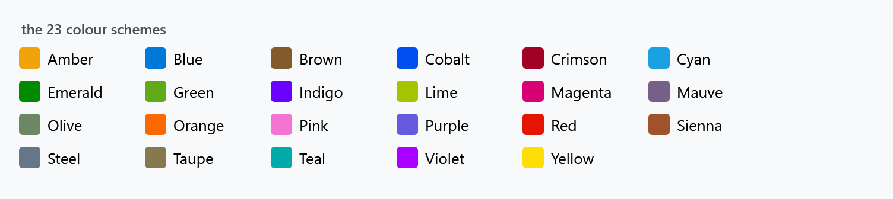
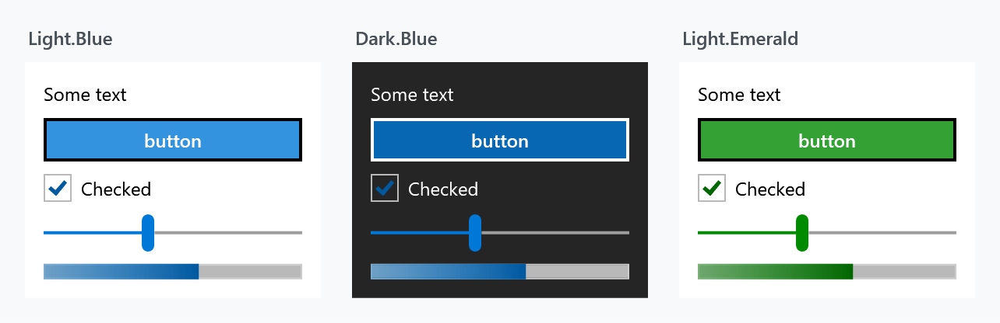

Order: 10
Title: Usage
Description: How to work with the Themes of MahApps.Metro
---

A MahApps theme is two choices: a **base theme**, which decides whether the application is light or dark, and a **colour scheme**, which decides the accent. Two base themes times twenty-three schemes gives forty-six resource dictionaries, and picking one is a single line in `App.xaml`.

## The colour schemes



`Amber`, `Blue`, `Brown`, `Cobalt`, `Crimson`, `Cyan`, `Emerald`, `Green`, `Indigo`, `Lime`, `Magenta`, `Mauve`, `Olive`, `Orange`, `Pink`, `Purple`, `Red`, `Sienna`, `Steel`, `Taupe`, `Teal`, `Violet`, `Yellow`.

Each one sets six colours: `MahApps.Colors.AccentBase` — the swatch above — then `Accent`, `Accent2`, `Accent3` and `Accent4`, which are the same colour at 80, 60, 40 and 20 per cent, and a darker `MahApps.Colors.Highlight`. Everything accent-coloured in the library comes from those six.

## The base themes

`Light` and `Dark`. The base theme changes the backgrounds, the greys and the text colour; it does **not** change the accent:



The first two panels are the same scheme on different bases — same blue, different surroundings. The third is a different scheme on the same base.

## Naming

A theme is named `Base.Scheme`, and the dictionary is at

```
pack://application:,,,/MahApps.Metro;component/Styles/Themes/Light.Blue.xaml
```

:::{.alert .alert-warning}
**Pack URIs are case sensitive.** `light.blue.xaml` fails, and it fails at run time rather than at build time — the application starts and the controls come out unstyled.
:::

## Choosing one in App.xaml

The usual way. The theme dictionary goes last, after `Controls.xaml` and `Fonts.xaml`:

```xml
<Application x:Class="SampleApp"
             xmlns="http://schemas.microsoft.com/winfx/2006/xaml/presentation"
             xmlns:x="http://schemas.microsoft.com/winfx/2006/xaml"
             StartupUri="MainWindow.xaml">
  <Application.Resources>
    <ResourceDictionary>
      <ResourceDictionary.MergedDictionaries>
        <!-- MahApps.Metro resource dictionaries. Make sure that all file names are Case Sensitive! -->
        <ResourceDictionary Source="pack://application:,,,/MahApps.Metro;component/Styles/Controls.xaml" />
        <ResourceDictionary Source="pack://application:,,,/MahApps.Metro;component/Styles/Fonts.xaml" />
        <!-- Theme setting -->
        <ResourceDictionary Source="pack://application:,,,/MahApps.Metro;component/Styles/Themes/Light.Blue.xaml" />
      </ResourceDictionary.MergedDictionaries>
    </ResourceDictionary>
  </Application.Resources>
</Application>
```

That is enough for an application whose theme never changes. Everything beyond it — switching at run time, giving one window a theme of its own, following the Windows setting, building a scheme that is not in the list — is the [ThemeManager](thememanager)'s job, and that page covers all four.

```csharp
using ControlzEx.Theming;

ThemeManager.Current.ChangeTheme(Application.Current, "Dark.Green");
```

## Where the dictionaries come from

There is no `Light.Blue.xaml` in the MahApps source tree, and looking for one is a common wrong turn. The forty-six dictionaries are **generated during the build** by `XamlColorSchemeGenerator` from two files:

| File | |
| --- | --- |
| `Styles/Themes/Theme.Template.xaml` | every brush and colour a theme defines, with `{{Placeholders}}` for the parts that vary |
| `Styles/Themes/GeneratorParameters.json` | the two base themes and the twenty-three schemes, each supplying values for those placeholders |

That template is the reference for what a theme can set. It defines over four hundred keyed colours and brushes, of which seventy-nine are placeholders that vary by theme; the rest are the same everywhere. It is the file to read when you want to know which brush a control is actually using. The [ThemeManager](thememanager) page shows how to build a theme of your own from the same template without rebuilding the library.

## Related

[ThemeManager](thememanager) for anything at run time. The [quick start](../guides/quick-start) shows the three dictionaries in place in a new project.
